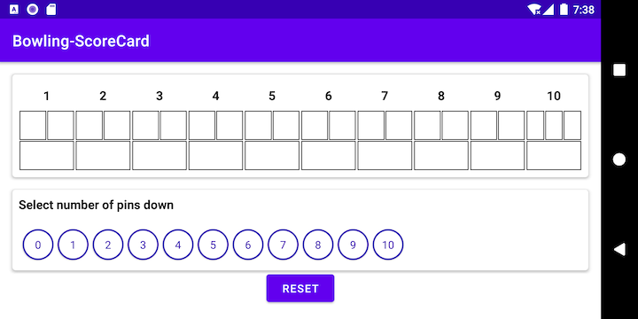

# Bowling Scoring Challenge

Design an interface to track the score of a single game of bowling. The interface will accept the result of each ball bowled and calculate the correct score, including spares and strikes. The interface must also indicate if the 10th frame includes a third ball.

The results of ball rolls are input one at a time, sequentially. The interface should assign the scores to the correct frames. Based on the current conditions, the interface should sanitize the inputs to only allow valid scores to be entered. The score should be displayed and updated as the rolls are entered. *Do not* assume all input will be entered at once.

## Example

Input: Strike, 7, Spare, 9, Miss, Strike, Miss, 8, 8, Spare, Miss, 6, Strike, Strike, Strike, 8, 1

| Frame |  1 | 2  | 3  | 4  | 5  | 6  | 7 | 8 | 9 | 10 |
|---|---|---|---|---|---|---|---|---|---|---|
| Input| X  |  7 / |  9 - | X  | - 8  |  8 / |  - 6 |  X | X  |  X 8 1 |
|Score|  20 | 39  |  48 | 66  | 74  |  84 |  90 |  120 | 148  | 167  |

## Bowling Game
* A game of bowling consists of 10 frames, in two balls are rolled per frame to attempt to knock down all ten pins.
* If all ten pins are knocked down in those two turns in the 10th frame, an extra bonus chance is awarded.
* A strike is defined as knocking down all ten pins in the first ball of a frame, signified with an X
* A spare is defined as knocking down all the remaining pins in the second ball of a frame, signified with a /
* A miss is defined as zero pins being knocked down on a roll, signified with a -

## Scoring Rules
* Generally, 1 point per pin knocked down.
* Strike - Score of 10 (for knocking down all ten pins), plus the total of the next two rolls
* Spare - Score of 10, plus the total number of pins knocked down on the next roll only
* Each frame displays the cumulative score up to that point for all complete frames. If a frame has a strike or spare, the score for that frame is not displayed until sufficient subsequent rolls have been input

## Implementation
The project is designed to have to main packages.
1. .game - Packages the components required for keeping track of the scoreboard and the business logic in the domain layer.
2. .ui - Packages the user interface specific for the application.

App supports both portrait and landscape orientation.

### Components
1. ScoreboardView - Represents the Scoreboard for the player.
2. PointSelectorView - UI for user to input the points.

### Domain layer
The domain layer for the game package handles the interaction with the UI layer and the core business logic.
The main classes are:

#### 1. GameEngine
* Interface that communicates with the UI layer of the app.
* Keeps track of the status of the game.
* Delegates the game execution to the ScoreboardHandler.

#### 2. ScoreboardHandler
* Handler class that executes the actual logic to validate and store the points.
* Handles the different calculations.
* Keeps track of the frame and no:of rolls the player has completed.

## Screenshots

